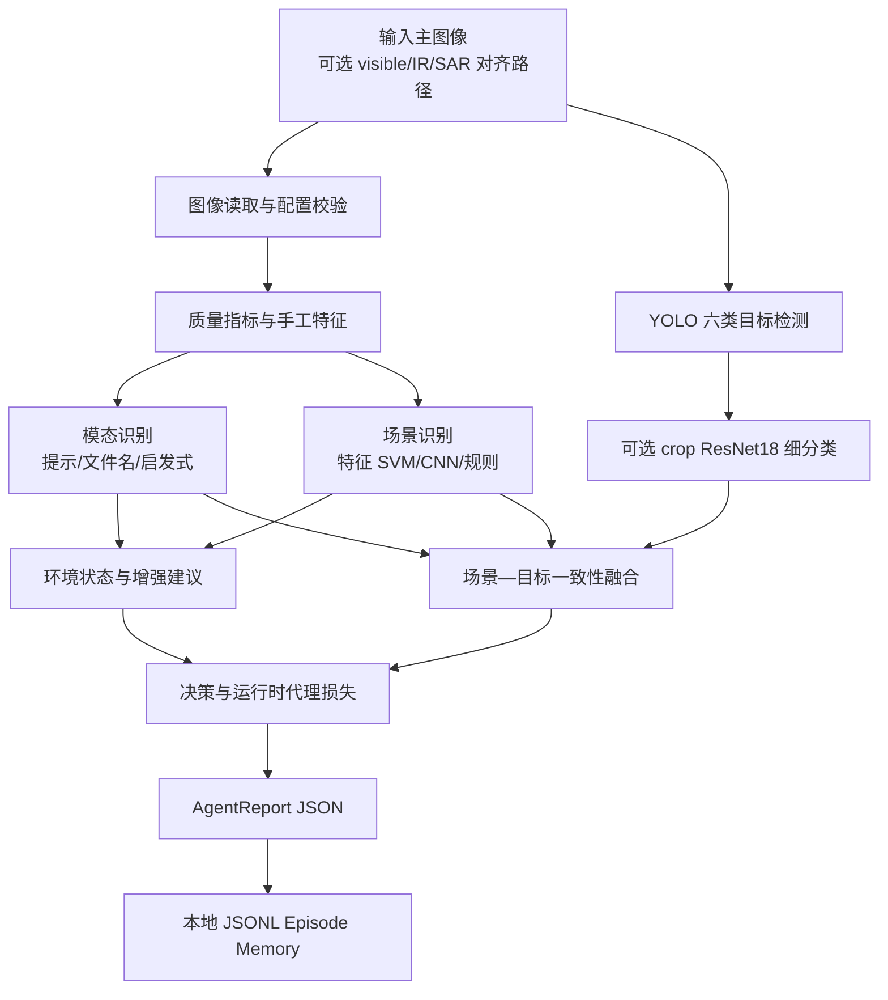
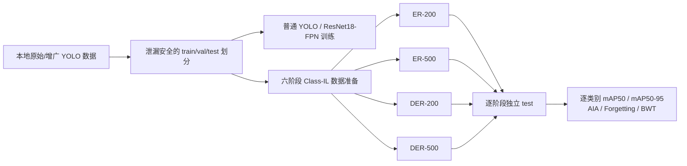

# ChallengeCup 智能识别与持续学习项目完整技术实现说明

> 文档版本：2026-08-28  
> 适用代码目录：`I:\项目\ChallengeCup`  
> 文档性质：当前代码实现、已完成实验、历史路线和后续规划的统一技术基线  
> 数据边界：本文涉及的数据集、模型权重和运行产物均为本地资产，不允许上传云端或提交 Git

---

## 1. 技术摘要

本项目已经形成了一套可在本地完整运行的遥感/多传感器图像识别工程，包含图像质量分析、传感器模态判断、四类场景识别、六类目标检测、可选目标裁剪分类、场景—目标一致性推理、JSON 报告与本地记忆、普通检测训练、六阶段类别增量学习（Class-IL）、ER/DER 经验回放对比，以及面向昇腾 310B 的部署打包工具。

当前真正投入主流程的核心模型路线是：

1. 场景识别默认优先使用手工特征 + RBF-SVM；也保留 ResNet18、MobileNetV3-Small、EfficientNet-B0 三种 CNN 训练路线。
2. 目标识别主路线使用 Ultralytics YOLO 检测器；ResNet18-FPN 是端到端检测对照，ResNet18 crop classifier 是有真实框条件下的分类上界/辅助校验，不应替代检测器。
3. 当前正式持续学习协议是六个目标类别依次到达的单头 Class-IL：`soldier → small_aircraft → warship → tank → patrol_boat → armored_vehicle`。
4. ER 使用固定容量、类别均衡的图像级回放池进行监督回放；DER 在 ER 的基础上，使用上一阶段冻结模型对回放图像在线生成暗响应，并约束旧类原始分类响应与框分布响应。
5. 已完成 ER/DER × buffer 200/500 共四组、每组六阶段的本地训练。ER-500 的最终精度最高；DER-500 的遗忘和负向后向迁移最小，但最终新类精度不如 ER-500。

必须特别说明：项目中还存在稀疏专家、原型库、软上下文融合、不确定性触发、切片二次推理、WBF、专家锚点和 P2 检测头等研究组件。它们有代码或测试，但目前没有全部接入 `IntelligentRecognitionAgent.run()` 或正式六阶段 Class-IL 训练器，不能把目标架构图直接当成已经落地的运行架构。

---

## 2. 文档范围与实现状态口径

本文使用以下四种状态，避免混淆“已经写了代码”和“已经进入正式流程”。

| 状态 | 含义 |
|---|---|
| 主流程已用 | 已由统一入口或 `IntelligentRecognitionAgent.run()` 实际调用，并经过测试或实验 |
| 独立可用 | 模块可单独调用，但不在默认 Agent 主链中 |
| 实验性脚手架 | 已有接口、算法雏形或配置，尚未形成闭环训练/推理 |
| 尚未实现 | 文档或测试中有目标，但代码缺失或没有可运行实现 |

当前模块状态总览如下。

| 能力 | 状态 | 当前实现 |
|---|---|---|
| 图像质量分析 | 主流程已用 | 灰度、动态范围、清晰度、噪声、边缘密度、色彩度等 |
| 传感器模态判断 | 主流程已用 | 显式提示、文件名规则、图像统计启发式 |
| 场景识别 | 主流程已用 | 特征 SVM 优先，CNN 可选，规则兜底 |
| YOLO 目标检测 | 主流程已用 | 本地 `.pt` 权重，六类检测 |
| 标签旁路 | 主流程已用但仅限调试 | 模型不可用时读取同名 YOLO 标签；不是推理结果 |
| crop ResNet18 目标细分类 | 独立可用/可选接入 | 对已有检测框裁剪后分类；旧四类模型对新增类有保护逻辑 |
| 场景—目标一致性融合 | 主流程已用 | 弱先验加权与冲突报告 |
| 本地 Episode Memory | 主流程已用 | JSONL 记录运行报告和人工反馈 |
| 六阶段 Class-IL | 主流程已用 | 单扩展检测头，逐类训练，阶段后独立测试 |
| ER-200/500 | 主流程已用 | 固定容量、类别均衡、图像级监督回放 |
| DER-200/500 | 主流程已用 | ER + 上一阶段教师暗响应约束 |
| 历史 4→6 增量微调 | 独立可用 | increment-only / replay 两种策略 |
| ResNet18-FPN 检测器 | 独立可用 | Faster R-CNN 风格端到端检测对照 |
| ExtraTrees 场景分类器 | 独立可用/历史路线 | 30 维特征 + ExtraTrees，不是当前默认后端 |
| 稀疏专家与 Top-K 路由 | 实验性脚手架 | NumPy 线性路由与用量记录，未训练、未接主链 |
| 原型库 | 实验性脚手架 | 类别—模态原型与相似度 logits，未接正式训练 |
| 不确定性二次评估 | 实验性脚手架 | 评分、触发、切片和 WBF 函数已存在，未接主链 |
| 专家锚点/多项持续学习损失 | 实验性脚手架 | 数值组件与组合函数，未接正式六阶段训练 |
| Copy-Paste 目标增广 | 尚未实现 | 测试引用 `Agent.data.copy_paste`，但 `Agent.data` 当前不存在 |
| Task-IL | 接口预留 | 协议含 `scenario`/`task_id`，尚无任务头、任务推断和正式调度器 |
| 昇腾 310B 推理 | 独立可用到打包阶段 | ONNX/ACL 脚本齐全；OM 转换和板端实测尚未完成 |

---

## 3. 系统总体架构

### 3.1 运行时主链



主实现位于：

- `Agent/agent.py`：完整编排；
- `Agent/config.py`：运行配置与默认路径；
- `Agent/schemas.py`：场景、模态、目标、检测框和报告结构；
- `Agent/image_ops.py`、`modality.py`、`scene.py`、`detection.py`、`target.py`：各推理阶段；
- `Agent/reasoning.py`：一致性融合与决策；
- `Agent/losses.py`：运行时代理损失；
- `Agent/memory.py`：本地 JSONL 记忆。

### 3.2 训练与评测主链



统一入口为根目录 `train.py`。它本身不包含训练算法，而是把命令转发给各模块，保证不同机器上的调用方式一致。

---

## 4. 代码目录与职责

```text
ChallengeCup/
├─ train.py                       # 全项目命令分发入口
├─ requirements.txt               # 通用依赖；torch/torchvision 需按设备单独安装
├─ Dockerfile                     # Python 3.12 基础运行镜像
├─ Agent/                         # 运行时 Agent、研究组件、桥接 CLI 与测试
├─ image_processing/              # 数据审计、质量分析、特征工程、场景数据准备
├─ scene_recognition/             # 场景分类、目标分类、检测、Class-IL
├─ scene_extratrees_classifier/   # 独立的历史 ExtraTrees 场景分类路线
├─ deployment/ascend310b/         # ONNX/OM 打包与 ACL 推理
├─ docs/                          # 项目报告、实验结果、诊断与部署说明
└─ 数据集（不上传git）/             # 本地数据、模型和运行产物，禁止上传
```

### 4.1 根入口支持的命令

`python train.py --help` 当前暴露以下命令：

| 命令 | 功能 |
|---|---|
| `image-processing` | 图像审计、特征提取和数据准备子命令 |
| `scene-recognition` | 场景训练、推理和可视化子命令 |
| `scene-prepare` | 审计数据并创建场景数据划分 |
| `scene-extract` | 提取手工场景特征 |
| `scene-evaluate` | 训练/评估特征场景分类器 |
| `crop-prepare` | 根据真实框生成目标裁剪数据 |
| `crop-classifier` | 训练 ResNet18 crop classifier |
| `whole-classifier` | 训练历史整图多标签分类器 |
| `prepare-detection` | 创建原始检测数据划分 |
| `prepare-comparison` | 创建原始/增广公平对比数据 |
| `split-yolo` | 保持来源组不泄漏地生成 val/test |
| `prepare-continual` | 准备历史 r2 增量/回放清单 |
| `prepare-class-il` | 准备正式六阶段 Class-IL 和 200/500 缓冲池 |
| `yolo` | 训练单个 YOLO 检测器 |
| `continual-yolo` | 运行历史单轮增量微调 |
| `class-il-yolo` | 运行六阶段 ER 或 DER |
| `continual-evaluate` | 计算 New-mAP、旧类 mAP 和 KRR |
| `resnet-detector` | 训练 ResNet18-FPN 检测器 |
| `detection-matrix` | 运行八组检测对比 |
| `yolo-evaluate` | 使用共享 AP 实现重评 YOLO |
| `ascend310b-package` | 构建昇腾 310B 可移植推理包 |

`Agent/cli.py` 另外提供单图 `infer`、批量 `batch`、人工反馈 `feedback`、损失组合 `loss`，并把训练命令桥接到根 `train.py`。

---

## 5. 数据模型、类别体系与隐私边界

### 5.1 场景、模态与目标类别

场景类别固定为四类：

```text
air, sea, urban, forest
```

传感器/模态固定为三类：

```text
visible, ir, sar
```

目标检测类别固定为六类，ID 和 Class-IL 到达顺序一致：

| ID | 类别 |
|---:|---|
| 0 | `soldier` |
| 1 | `small_aircraft` |
| 2 | `warship` |
| 3 | `tank` |
| 4 | `patrol_boat` |
| 5 | `armored_vehicle` |

正式 Class-IL 数据准备器会强制检查：类别总数必须等于 6、类别名必须与项目常量一致、顺序必须与 YOLO `data.yaml` 的类别 ID 顺序一致。这样可以避免阶段顺序与检测头通道错位。

### 5.2 当前正式六类数据

本地合并数据源：

```text
I:\项目\ChallengeCup\数据集（不上传git）\yolo_r1_r2inc_augmented_full
```

泄漏安全的固定划分：

```text
I:\项目\ChallengeCup\数据集（不上传git）\yolo_r1_r2inc_augmented_full_tvt_seed42
```

其 `data.yaml` 定义 `train`、`val`、`test` 三个独立目录和六类 ID。划分使用 seed 42，并把同一来源帧的原图与增广变体视为同一来源组，避免它们跨 train/val/test 泄漏。

当前划分统计：

| 划分 | 来源组/图像口径 | 用途 |
|---|---:|---|
| train | 2,828 张图像，来自 707 个来源组 | 参数更新和回放池采样 |
| val | 92 张图像 | 早停、checkpoint 选择 |
| test | 91 张图像 | 每阶段训练完成后的独立本地评估 |

测试集目标框数量：

| 类别 | 框数 |
|---|---:|
| soldier | 63 |
| small_aircraft | 70 |
| warship | 68 |
| tank | 96 |
| patrol_boat | 42 |
| armored_vehicle | 45 |

`patrol_boat` 和 `armored_vehicle` 各只有 7 个测试来源组，因此这两个新增类的指标方差预计较大。

### 5.3 数据格式

目标检测采用标准 YOLO 标签：

```text
class_id x_center y_center width height
```

坐标均归一化到 `[0, 1]`。代码会拒绝越界类别和非法归一化框。

场景与批量 Agent 主要使用 CSV 清单。常见字段包括 `image_path`/`image`、`sensor`、`scene`、`split`、来源帧和增广方式等。数据准备器支持目录、单张图片和图片列表文件作为 YOLO split 输入。

### 5.4 隐私与 Git 规则

`.gitignore` 已忽略：

- `数据集（不上传git）/`、`data/`、`dataset/`、`datasets/`；
- `runs/` 和各模块生成的 artifacts/runs；
- `.pt`、`.pth`、`.ckpt`、`.onnx`、`.om`、`.engine`、`.joblib`；
- 图像、CSV、压缩包和常见实验产物。

因此本项目的默认边界是：代码和人工编写文档可以进入 Git，数据集、模型权重、绝对路径清单、原始预测、JSONL 记忆和训练产物只能保留在本机。任何向云端训练、云盘、在线标注平台或远端制品库发送这些资产的操作均不属于当前授权范围。

---

## 6. 图像处理与特征工程

### 6.1 质量分析

`image_processing/scene_runtime.py` 与 `Agent/image_ops.py` 对输入图像计算以下指标：

- 图像宽高、模式和长宽比；
- 灰度均值、标准差和动态范围；
- 拉普拉斯/梯度相关清晰度；
- 高频噪声估计；
- 边缘密度；
- 色彩度。

质量指标会映射为噪声、清晰度、对比度等离散等级。若存在训练集校准文件，则用训练分位数做阈值校准；否则使用代码默认阈值。

增强策略不是在 Agent 推理时直接改写输入，而是生成建议：

- 高噪声：散斑抑制或保边去噪；
- 低对比/低动态范围：强度拉伸；
- 低清晰度：锐化；
- 质量正常：不增强。

### 6.2 手工特征

`image_processing/feature_engineering.py` 先把图像转为 128×128 灰度图，再提取三组特征。

1. 强度统计：均值、标准差、分位数、熵、偏度、峰度、暗像素/亮像素比例等。
2. 纹理特征：Sobel/梯度、Laplacian、局部标准差、16 维 LBP 直方图，以及多个距离和方向的 GLCM 特征。
3. 频域特征：FFT 低/中/高频能量、频谱熵和加权半径。

特征模块既为场景 SVM 提供输入，也为 Agent 的质量判断和解释报告提供数值依据。

### 6.3 特征场景分类训练

特征场景分类流程为：

1. `StandardScaler` 标准化；
2. `SelectKBest(ANOVA F)` 做特征筛选；
3. 候选 `k = 5, 10, 15, 20, 30, 40, 50, 60`，以验证集 Macro-F1 选最优特征数；
4. 使用 RBF-SVC，默认 `C=3`、`class_weight=balanced`、开启概率输出；
5. 在 train+val 上重新拟合最佳配置；
6. 保存 joblib 模型、元数据、预测表和混淆矩阵。

历史已记录结果为场景 Accuracy 92.79%、Macro-F1 92.25%。该结果属于对应历史数据划分，不能自动代表新数据上的性能。

### 6.4 ExtraTrees 历史路线

`scene_extratrees_classifier/` 提供独立的 30 维灰度/纹理/频谱特征 + `ExtraTreesClassifier` 流程，含训练、单图推理和说明文档。它不由当前 Agent 默认加载，属于可复现的历史基线。

---

## 7. 场景分类模型

### 7.1 Agent 的场景后端优先级

`Agent/scene.py` 的实际优先级如下：

1. 若配置了有效的特征 SVM 和元数据，使用手工特征进行概率预测；
2. 若配置了场景 CNN checkpoint，则尝试 CNN；
3. 若模型缺失或失败，则使用文件名和质量统计启发式；
4. 低于 `scene_threshold=0.45` 时在结果详情中标注不确定性，但仍保留原始最高概率场景供下游弱融合。

### 7.2 CNN 场景分类路线

`scene_recognition/train_scene_classifier.py` 支持：

- ResNet18；
- MobileNetV3-Small；
- EfficientNet-B0。

默认配置为 ResNet18、输入 224、12 epochs、AdamW、学习率 `3e-4`、权重衰减 `1e-4`、带类别权重和 `label_smoothing=0.05` 的交叉熵、余弦学习率、seed 42、AMP。该路线可独立训练，但不是当前默认 Agent 场景模型。

---

## 8. Agent 完整推理流程

### 8.1 输入与配置

`AgentConfig` 的关键默认值：

| 参数 | 默认值 | 含义 |
|---|---:|---|
| `scene_threshold` | 0.45 | 场景置信度阈值 |
| `detector_confidence` | 0.25 | YOLO 检测阈值 |
| `image_size` | 640 | YOLO 推理尺寸 |
| `device` | `auto` | 自动选择设备 |
| `allow_label_fallback` | `True` | 允许调试用同名标签旁路 |
| `use_scene_prior_for_unknown_targets` | `True` | 仅对 unknown 目标使用场景先验 |
| `remember_runs` | `True` | 写入本地 JSONL 记忆 |

默认会尝试读取 `scene_recognition/runs/feature_baseline/` 下的场景 SVM；检测器和 crop classifier 默认不自动指定，需要运行时传入本地权重。

### 8.2 模态识别

`Agent/modality.py` 按以下优先级判定 visible/IR/SAR：

1. 用户显式 `--sensor` 提示，置信度约 0.98；
2. 文件名中的模态别名，置信度约 0.94；
3. 根据色彩度、对比度、噪声、清晰度等统计量进行确定性启发式分类。

它目前不是经过训练的模态分类神经网络。因此在真实部署中，应尽量由采集设备元数据提供传感器类型。

### 8.3 多模态输入边界

CLI 支持 `--visible`、`--ir`、`--sar` 三个对齐路径，但当前主链只选择一张主图执行特征、场景和检测，并把对齐路径写入报告。尚未实现像素配准、跨模态特征融合或多分支联合检测。文档中所称“多模态支持”目前是输入组织和元数据支持，不是完整的多模态融合模型。

### 8.4 目标检测

`Agent/detection.py` 在给定本地 `.pt` 后惰性加载 Ultralytics YOLO：

1. 使用配置的 `conf`、`imgsz` 和设备执行 `predict`；
2. 把输出框转换为 `[0,1]` 归一化 `xyxy`；
3. 保存类别名、置信度、坐标和来源。

若模型缺失或推理失败，并且 `allow_label_fallback=True`，则读取图片旁边同名 `.txt` YOLO 标签，默认置信度为 1。这个旁路只用于离线流程演示和单元测试，等价于读取真实标签，绝不能用于报告模型精度。正式推理应带 `--no-label-fallback`。

### 8.5 可选目标细分类

`Agent/target.py` 可在 YOLO 框基础上：

1. 对框外扩约 8%；
2. 裁剪目标区域；
3. 调用 ResNet18 crop classifier；
4. 合并分类概率和检测标签。

如果旧 crop checkpoint 只认识四类，而 YOLO 已检测到 `patrol_boat` 或 `armored_vehicle`，代码会保留高置信度的新增类标签，避免旧模型把它覆盖成旧类。若 crop 模型不可用，场景先验只会填充 `unknown`，不会替换正常的 YOLO 类别。

### 8.6 场景—目标一致性融合

`Agent/reasoning.py` 定义了弱一致性关系：

| 场景 | 合理目标 |
|---|---|
| air | small_aircraft |
| sea | warship, patrol_boat |
| urban | soldier, tank, armored_vehicle |
| forest | soldier, tank, armored_vehicle |

融合过程不是硬规则过滤：

- 原场景概率保留约 0.72 权重；
- 检测目标投票总量约 0.24；
- 模态只施加很小偏置，例如 SAR 对 sea/urban；
- 最后归一化并输出一致性状态、冲突数量和修复说明。

因此，检测结果可以修正场景，但不会因先验不一致而直接删除目标框。

### 8.7 决策输出

Agent 最终决策包含：

- 推荐检测器 profile；
- 根据噪声和场景置信度调整的检测阈值；
- 当前重点类别；
- 传感器、场景与手工特征的建议权重；
- 图像增强建议；
- 可读的场景和目标说明。

决策中出现的“目标—模态专家”“adapter”等名称目前是解释性路由字符串，不代表 `Agent/models/experts` 中的专家网络已经执行。

### 8.8 运行时代理损失

`estimate_runtime_losses()` 给出的是置信度/一致性诊断，不参与反向传播：

\[
L_{proxy}=0.3L_{moti}+0.6L_{env}+L_{box}+L_{cls}+0.2L_{detail}+0.4L_{proto}
\]

其中：

- `L_moti = 1 - 模态置信度`；
- `L_env = 1 - 场景置信度`；
- `L_box` 和 `L_cls` 来源于平均检测置信度；
- `L_detail` 来源于高噪声和低清晰度惩罚；
- `L_proto` 实际使用场景—目标不一致率作为代理。

`combine_training_losses()` 只是通用算术工具，可组合 `L_box + L_cls + L_dfl + λ_detail L_detail + λ_scene L_scene + λ_proto L_proto + λ_moti L_moti`，但当前没有连接到 YOLO 或 Class-IL 的实际训练回路。

### 8.9 AgentReport 与本地记忆

每次运行生成结构化 `AgentReport`，主要字段包括：

- 输入和对齐模态路径；
- 质量、手工特征、模态概率、原始场景和最终场景；
- 目标框和分类；
- 环境状态与增强建议；
- 一致性报告、决策、代理损失；
- 各阶段耗时、警告和内存摘要。

`EpisodeMemory` 默认把报告逐行追加到 `Agent/artifacts/agent_memory.jsonl`，人工 `feedback` 也会追加。当前反馈仅被保存和统计，不会自动进入 ER/DER 缓冲池，也不会触发模型更新。

---

## 9. 目标分类与检测模型

### 9.1 历史整图多标签分类器

项目曾使用整图 ResNet18 预测目标存在性。诊断发现目标标签与场景高度确定性相关，即使遮挡目标，模型表现也几乎不变；这说明模型主要利用背景场景捷径，不能作为目标识别证据。因此该模块保留用于复现和负面基线，不应作为最终目标检测模型。

### 9.2 ResNet18 crop classifier

crop classifier 使用真实 YOLO 框裁剪目标，执行单目标四类分类。历史测试 Accuracy 99.79%、Macro-F1 99.78%，但“场景 + 尺寸”无像素基线已达到 97.67%，说明数据偏差很强。同时该模型依赖真实框或上游检测框，因此只能作为：

- 分类上界；
- 检测后细分类；
- 混淆诊断工具。

它不能与端到端检测 mAP 直接比较。

### 9.3 YOLO 检测器

`train_detector_ablation.py` 的默认训练参数包括：

- YOLOv8n 权重或结构；
- epochs 150；
- patience 20；
- image size 640；
- batch 16；
- workers 4；
- seed 42；
- Ultralytics 默认损失、自动优化器、余弦学习率和 AMP。

从头训练时必须使用 `.yaml` 架构并设置 `pretrained=False`，代码会拒绝把 `.pt` checkpoint 错当作 scratch。

`detection-matrix` 支持 8 组公平对照：

```text
YOLO / ResNet18-FPN
× 原始 / 增广数据
× 预训练 / 从头训练
```

### 9.4 ResNet18-FPN 检测器

`resnet18_detector.py` 实现 Faster R-CNN 风格检测器：

- ResNet18 主干 + FPN；
- anchor 尺寸 8/16/32/64/128；
- aspect ratio 0.5/1/2；
- ROI Align；
- 低推理 score threshold 0.001，用于完整 AP 扫描；
- 单图最多 200 个候选；
- 默认 AdamW `2e-4` + cosine；
- 以 mAP@0.5 为主、mAP@0.5:0.95 为辅选择 checkpoint。

历史对比中 ResNet18-FPN 最佳 mAP@0.5 为 87.20%，YOLOv8n 最佳为 85.25%；这些数字属于旧四类对比协议，不是六阶段 Class-IL 结果。

### 9.5 共享 AP 实现

项目实现了 COCO 风格 101 点插值 AP，支持：

- mAP@0.5；
- mAP@0.5:0.95，即 IoU 0.50 到 0.95、步长 0.05 的平均；
- 逐类别 Precision/Recall/AP；
- 场景和传感器切片；
- YOLO 与 ResNet 检测器使用统一口径重评。

`mAP@0.5` 只要求 IoU≥0.5，主要反映“找没找到”；`mAP@0.5:0.95` 同时要求更精确的定位，是更严格的框质量指标。逐阶段逐类别表则回答每个旧类在后续学习过程中是否发生遗忘。

---

## 10. 普通训练、数据准备与比较协议

### 10.1 泄漏控制

数据划分器使用来源组而不是单张输出图片分割数据。原图及其翻转、旋转、形态学处理等增广版本会被绑定到同一 split，避免相邻帧或增广副本造成测试集虚高。

### 10.2 原始/增广公平比较

公平比较要求：

- 原始组和增广组共享同一独立 holdout；
- 训练预算可比；
- 明确区分离线增广和 Ultralytics 在线增广；
- 输出中记录数据版本、split 和增广开关；
- 若 split 或在线增广设置不一致，比较工具会产生警告。

### 10.3 历史 4→6 增量路线

`prepare_continual_dataset.py` 和 `train_continual_yolo.py` 实现了旧四类模型一次性扩展到六类的历史协议：

- `increment_only`：只用新增数据微调；
- `replay`：新增数据 + 最多 200 张旧类回放；
- 使用本地 checkpoint，不下载基础模型；
- 输出 old/new/all mAP 和知识保持率 KRR。

这一实现是普通 YOLO 微调/监督回放。代码明确没有实现响应蒸馏、P2/P3 特征蒸馏或专家锚点，因此不能把该路线描述为 KD。它用于历史复现，当前正式需求已经转为逐类六阶段 Class-IL。

---

## 11. 六阶段 Class-IL 协议

### 11.1 问题定义

当前场景是 Class-Incremental Learning：

- 每阶段只到达一个新类别；
- 推理时不提供 task id；
- 所有已学类别共享一个不断扩展的检测头；
- 阶段结束后必须同时识别所有已见类别；
- 训练时不能使用未来类别标签；
- 固定容量回放池只能保存有限旧样本。

六个阶段为：

| 阶段 | 新类 | 阶段结束后可识别类别 |
|---:|---|---|
| T1 | soldier | soldier |
| T2 | small_aircraft | soldier, small_aircraft |
| T3 | warship | soldier, small_aircraft, warship |
| T4 | tank | soldier, small_aircraft, warship, tank |
| T5 | patrol_boat | soldier, small_aircraft, warship, tank, patrol_boat |
| T6 | armored_vehicle | 全部六类 |

### 11.2 阶段数据物化

`prepare_class_incremental_dataset.py` 为每个阶段生成：

- 当前新类训练样本；
- `replay_before`：进入本阶段前的旧类缓冲池；
- `buffer_after`：本阶段结束后供下一阶段使用的缓冲池；
- 当前类 + 旧类回放的混合 `train.txt`；
- 只含已见类的累计 `val.txt` 和 `test.txt`；
- 阶段专属 `data_buffer_200.yaml` / `data_buffer_500.yaml`；
- 缓冲池类别计数和来源信息 JSON。

当前新类样本的标签会过滤为当前类，回放样本会过滤为它在缓冲池中占用的旧类槽位。这样即使一张源图含多个对象，也不会泄漏未来类标签。

图片优先使用硬链接物化；文件系统不支持硬链接时才复制。整个准备流程只在本地进行。

### 11.3 回放池选择

回放池容量固定为 200 或 500。选择策略满足：

1. 类别轮转，尽量均衡每个已见类别；
2. 同一路径不重复占用；
3. 优先覆盖不同来源帧；
4. 同一来源组中优先原图，再考虑增广变体；
5. seed 42 下确定性复现；
6. 总图像数不超过硬容量。

这是图像级固定缓冲池，不是无限保留全部旧数据，也不是按每类分别给 200/500 张。

### 11.4 单扩展头

每阶段的数据 YAML 只声明截至当前的类别前缀。上一阶段 `best.pt` 作为下一阶段初始 checkpoint，Ultralytics 根据新类别数扩展检测头。DER 额外要求教师类别名必须正好是学生类别名的有序前缀，防止通道错配。

---

## 12. ER 的具体实现

ER（Experience Replay）在本项目中是标准监督经验回放。

第 `t` 阶段训练集为：

\[
D_t^{train}=D_t^{current}\cup B_{t-1}
\]

其中 `D_t^{current}` 是当前新类样本，`B_{t-1}` 是进入本阶段前的固定容量旧类缓冲池。

训练损失就是 Ultralytics YOLO 的常规检测损失：

\[
L_{ER}=L_{YOLO}(D_t^{current}\cup B_{t-1})
\]

实现特征：

- 新类和回放图像在同一训练清单中混合；
- 回放样本保留真实检测标签；
- 没有教师模型；
- 没有额外 logits/响应约束；
- 每阶段用验证集早停和选择 `best.pt`；
- 阶段后才在独立本地 test 上评估；
- T1 没有旧类，因此 ER 与 DER 理论上等价。

---

## 13. DER 的具体实现

### 13.1 当前 DER 的性质

当前实现是面向目标检测的 DER-style 在线教师响应回放：保留 ER 的真实标签监督，同时在旧类回放图像上匹配上一阶段模型的原始检测响应。

它与原始分类 DER 论文“缓存样本 + 缓存 logits，然后最小化 logits MSE”的精神一致，但工程实现不完全相同：

- 没有把每张图的检测头多尺度张量永久缓存到磁盘；
- 使用上一阶段冻结 checkpoint 在线重算暗响应；
- 约束对象包括旧类分类通道和框分布通道；
- 仍保留真实标签监督，因此更接近带监督回放的 DER/DER++ 检测适配。

这样做的主要原因是检测器每张图会产生多个尺度、多个空间位置和框分布，直接缓存比分类 logits 大得多，而且容易因输入尺寸、增强和检测头结构变化失效。

### 13.2 教师与学生

从 T2 开始：

- 教师：上一阶段 `best.pt`，完全冻结；
- 学生：由上一阶段 checkpoint 初始化并扩展一个新类通道；
- 教师参数不进入优化器；
- 教师只处理当前 batch 中属于 `replay.txt` 的图像；
- 当前新类图像只计算常规 YOLO 监督损失。

### 13.3 回放掩码

`DarkReplayModel` 使用 batch 中的 `im_file`，经过 Windows 大小写无关的绝对路径归一化后，与阶段 `replay.txt` 集合比较，生成布尔 mask。只有 mask 为真的回放图像进入教师模型和 DER 损失。

### 13.4 原始响应匹配

对常规 YOLO 检测头，设 `reg_max` 为离散框分布通道数，旧类数为 `C_old`。每个尺度原始输出包含：

```text
4 × reg_max 个框分布通道 + 类别通道
```

学生可能比教师多一个新类通道，但只取前 `C_old` 个类别通道与教师匹配，新类不受蒸馏约束。

教师置信度权重为：

\[
w=\max_c \sigma(z^T_c)\cdot \mathbb{1}[\max_c\sigma(z^T_c)\ge\tau]
\]

分类暗响应损失：

\[
L_{dark\_cls}=\frac{\sum w\,(z^S_{old}-z^T)^2}{\sum w\,C_{old}}
\]

框分布暗响应损失：

\[
L_{dark\_box}=\frac{\sum w\,(b^S-b^T)^2}{\sum w\,C_{box}}
\]

多个检测尺度分别计算后取平均。YOLO26 风格的解耦 `boxes`/`scores` 输出也有专门兼容分支。

### 13.5 最终损失与超参数

\[
L_{DER}=L_{YOLO}+\lambda_{DER}
\left(\lambda_{cls}L_{dark\_cls}+\lambda_{box}L_{dark\_box}\right)
\]

当前默认参数：

| 参数 | 默认值 |
|---|---:|
| `der_weight` / `λ_DER` | 1.0 |
| `der_cls_weight` / `λ_cls` | 1.0 |
| `der_box_weight` / `λ_box` | 0.25 |
| `der_min_confidence` / `τ` | 0.0 |

训练日志把额外项注册为 `der_loss`。为匹配 Ultralytics 的 batch loss 缩放，代码会按 batch size 对返回给 trainer 的 DER 标量进行缩放。

### 13.6 与原始 DER 的差异不能隐瞒

当前实现不能写成“严格复现原论文公式”，正确表述应为：

> 本项目实现了检测适配的 DER-style 在线教师暗响应回放：以固定图像缓冲池和真实标签监督为基础，使用上一阶段冻结教师对回放样本重算旧类分类/框分布响应，并做置信度加权 MSE 匹配。

若要做严格论文复现，需要额外实现：稳定的数据增强对齐、每样本/每位置暗响应缓存格式、缓存版本控制、与原论文分类设置一致的基线，以及公平的离线存储预算核算。

---

## 14. Class-IL 训练器执行逻辑

`train_class_incremental_yolo.py` 每次启动会：

1. 检查 prepared summary、阶段数、类别顺序和 buffer size；
2. 检查每阶段 YAML 类别是否与已学类别前缀一致；
3. 检查 T1 replay 必须为空、T2–T6 replay 必须非空且不超过容量；
4. 要求初始模型是本地 `.pt` 或 `.yaml`，不允许隐式联网下载；
5. 检查初始 checkpoint 是否已经包含未来目标类，防止起点泄漏；
6. 依次训练六阶段；
7. ER 使用标准 trainer，DER 使用 `ReplayAwareDERTrainer`；
8. 每阶段以 `best.pt` 进入下一阶段；
9. 在 val 上做选择，在 test 上做阶段后评估；
10. 汇总逐阶段、逐类别性能和持续学习指标。

默认训练参数：

| 参数 | 默认值 |
|---|---:|
| epochs | 30 |
| patience | 10 |
| image size | 640 |
| batch size | 8 |
| workers | 0 |
| seed | 42 |
| learning rate | 1e-3 |
| device | 有 CUDA 时 `0`，否则 `cpu` |
| AMP | 开启，可用 `--no-amp` 关闭 |

支持 `--dry-run` 检查协议、路径和模型泄漏，也支持 `--stop-after-stage` 做冒烟测试或分阶段执行。

---

## 15. 持续学习评测指标

设 `R[t,k]` 为学习完阶段 `t` 后，第 `k` 个已见类别的 AP。

### 15.1 最终平均性能

\[
FinalAvg=\frac{1}{T}\sum_{k=1}^{T}R[T,k]
\]

分别对 mAP@0.5 和 mAP@0.5:0.95 计算。

### 15.2 平均增量精度 AIA

先计算每个阶段全部已见类别的平均 AP，再对所有阶段求平均：

\[
AIA=\frac{1}{T}\sum_{t=1}^{T}\frac{1}{t}\sum_{k=1}^{t}R[t,k]
\]

### 15.3 平均遗忘

对每个旧类，比较它历史最好值与最终值：

\[
F_k=\max_{t\in[k,T]}R[t,k]-R[T,k]
\]

再对旧类求平均。越低越好。

### 15.4 后向迁移 BWT

代码比较旧类刚学完时的性能与最终性能：

\[
BWT=\frac{1}{T-1}\sum_{k=1}^{T-1}(R[T,k]-R[k,k])
\]

负值表示后续学习使旧类性能下降，越接近 0 越稳定；正值表示后续任务反而改善了旧类。

### 15.5 评测边界

当前 test 是本地独立 holdout：不参与早停或 checkpoint 选择，因此在项目内部协议中属于正式独立测试；但它不是竞赛主办方隐藏测试集，不能写成竞赛官方成绩。

---

## 16. 已完成六阶段实验结果

训练环境：Windows 10、Python 3.11.2、PyTorch 2.6.0+cu124、Ultralytics 8.4.100、CUDA device 0。四组实验均完成六阶段。

### 16.1 总体结果

| 方法 | Buffer | 最终 mAP@0.5 | 最终 mAP@0.5:0.95 | AIA@0.5 | 遗忘@0.5 | BWT@0.5 |
|---|---:|---:|---:|---:|---:|---:|
| ER | 200 | 77.88% | 37.68% | 73.98% | 12.21% | -9.90% |
| ER | 500 | **85.24%** | **41.97%** | **76.80%** | 5.76% | -2.69% |
| DER | 200 | 75.80% | 36.73% | 70.38% | 5.55% | -3.02% |
| DER | 500 | 81.08% | 40.02% | 74.17% | **2.56%** | **-0.20%** |

### 16.2 结果解读

- 若目标是最终综合识别精度，当前应优先选择 ER-500。
- 若目标是最大限度保持旧类稳定性，DER-500 最优，其 mAP@0.5 平均遗忘只有 2.56%，BWT 接近 0。
- DER-500 的稳定性提升没有转化为更高最终精度，主要损失出现在最后新增类 `armored_vehicle`：DER-500 最终 mAP@0.5 为 76.82%，ER-500 为 98.68%。
- ER-200 的缓冲池不足导致明显遗忘，尤其是 soldier；把容量从 200 增加到 500 对 ER 改善明显。
- DER-200 比 ER-200 稳定，但新类学习能力较弱；说明当前蒸馏权重和新旧类平衡仍需调参。
- 所有结论只基于 seed 42 单次实验，尚没有多随机种子均值和置信区间。

逐阶段、逐类别 mAP@0.5、mAP@0.5:0.95、Precision、Recall、耗时和完整命令见：`docs/六阶段类增量训练完整实验报告-20260828.md`。

### 16.3 结果文件

每组运行根目录保存：

```text
class_incremental_training_summary.json
stage_01_soldier/
...
stage_06_armored_vehicle/
```

总 summary 包含：协议版本、方法、buffer、类别顺序、初始/最终模型、阶段列表、持续学习指标、环境、隐私范围和耗时。每阶段 summary 包含训练配置、模型路径、val/test 汇总和逐类别指标。

Ultralytics 的 `results.csv` 主要提供每个 epoch 的整体训练/验证损失和整体检测指标；当前没有在每个 epoch 自动输出完整的“所有已见类别 × test”的矩阵。严格逐类矩阵是在每个阶段结束后生成，以避免反复窥视 test。

---

## 17. 研究架构组件及真实接入状态

### 17.1 软上下文融合

`Agent/models/adapters/context_fusion.py` 实现：

\[
z_{final}=z_{det}+\alpha W_s p_{scene}+\beta W_m p_{modality}
\]

默认 `α=0.2`、`β=0.1`。它有单元测试验证是加性弱先验而非硬覆盖，但主 Agent 当前使用 `reasoning.py` 中的规则概率融合，没有调用该类。

### 17.2 稀疏专家路由

`Agent/models/experts/router.py` 提供 NumPy Top-K 路由器。输入由全局池化特征、模态、场景和运行统计拼接，经过随机初始化的线性映射选专家，并记录专家使用次数。当前它没有训练代码、没有真实专家网络，也没有接入主 Agent。

### 17.3 辅助头

`Agent/models/aux_heads/heads.py` 包含 GAP、Linear、SiLU、Dropout 后的 embedding，以及模态和场景头。它是 PyTorch 可用的组件包装，但没有挂载到当前 detector backbone，也未被正式训练脚本调用。

### 17.4 原型库

`Agent/models/prototypes/bank.py` 可按“类别—模态”维护 L2 归一化 EMA 原型，默认 momentum 0.9，并构造共享类别原型和温度缩放相似度 logits。它只被旧版 `ContinualLearningManager` 和测试使用，当前 DER 不使用原型损失。

### 17.5 专家锚点与持续学习损失组合

`Agent/continual/anchors/expert_anchor.py` 支持参数 EMA、重要性和偏离惩罚；`Agent/models/losses/continual_losses.py` 可组合 detection、KD、feature、prototype、relation、anchor 项。两者目前都是数值/接口组件，未接入正式 YOLO optimizer。

### 17.6 P2 检测头

`Agent/models/yolo_p2/spec.py` 能生成含 P2/P3/P4/P5 检测层的 YOLOv8n-P2 YAML，目标是改善小目标。旧版 `continual_tool.py` 可以使用它启动普通检测训练，但当前六阶段 ER/DER 以提供的本地 checkpoint 架构为准，没有默认切换到 P2。

### 17.7 不确定性、级联、切片和融合

`Agent/inference/` 已实现：

- 不确定性：熵、`1-pmax`、专家分歧、场景分歧的加权和；
- 二次评估触发：高不确定、无检测、低置信 soldier、微小 soldier、场景冲突；
- 2×2/3×3 重叠切片及坐标映射；
- 类别内 NMS 和简化 Weighted Box Fusion。

这些函数有单元测试，但没有完整的“首轮检测 → 触发 → 裁切图片 → 二次 YOLO → 回映射 → WBF”主链。因此它们是可复用的实验组件，不是当前 Agent 的实际推理行为。

### 17.8 旧版 ContinualLearningManager

`Agent/continual/manager/manager.py` 和 `Agent/scripts/continual_tool.py` 可以：

- 从场景索引构建任务计划；
- 筛选当前任务样本；
- 维护一个按稀有度/不确定性/困难度/覆盖率评分的回放池；
- 导出训练 YAML；
- 调用普通 detector ablation 训练。

但该管理器仍以旧四类配置为主，且没有把 KD、原型和专家锚点真正加入训练回路。它与正式六阶段 Class-IL 的类别均衡固定缓冲池是两套不同实现，不能混为一谈。

---

## 18. 配置文件说明

`Agent/configs/` 下的 JSON 主要表达研究目标，不等于运行状态。

### 18.1 `default_incremental_protocol.json`

这是旧的三阶段模态/场景/类别混合协议，描述 IR→SAR、场景变化和四类目标到达。它不是当前正式六个 singleton 类阶段协议。

### 18.2 `default_yolov8n_p2.json`

配置中声明 P2、软上下文融合、Top-K 专家、原型 momentum、蒸馏温度和二次评估参数。当前并不存在一个读取该 JSON 后自动组装所有模块的完整训练器，因此它属于目标配置/实验蓝图。

### 18.3 `first_stage_soldier.json`

该配置定义 soldier 改进的消融顺序：baseline、P2、困难采样、Copy-Paste、切片二次评估。Copy-Paste 模块当前缺失，整套消融尚未完成。

---

## 19. 运行方式

以下命令均在项目根目录执行。路径中含中文和括号时必须加双引号。

### 19.1 安装依赖

先按目标机器 CUDA/CPU 环境安装匹配的 PyTorch 和 torchvision，再安装其余依赖：

```powershell
python -m pip install -r requirements.txt
```

项目要求 `ultralytics>=8.4,<8.5`。已验证实验环境使用 8.4.100。

### 19.2 单图 Agent 正式推理

```powershell
python -m Agent.cli infer `
  --image "I:\path\to\image.png" `
  --sensor sar `
  --scene-model "I:\path\to\scene_feature_svm.joblib" `
  --scene-metadata "I:\path\to\model_metadata.json" `
  --detector-model "I:\path\to\best.pt" `
  --detector-confidence 0.25 `
  --image-size 640 `
  --device 0 `
  --no-label-fallback `
  --output "I:\path\to\report.json"
```

如果只检查流程且不希望写入历史记录，加 `--no-memory`。

### 19.3 批量 Agent 推理

```powershell
python -m Agent.cli batch `
  --manifest "I:\path\to\manifest.csv" `
  --output-dir "I:\path\to\agent_reports" `
  --split test `
  --detector-model "I:\path\to\best.pt" `
  --no-label-fallback
```

### 19.4 准备六阶段数据

```powershell
python train.py prepare-class-il `
  --data "I:\项目\ChallengeCup\数据集（不上传git）\yolo_r1_r2inc_augmented_full_tvt_seed42\data.yaml" `
  --output "I:\项目\ChallengeCup\数据集（不上传git）\class_il_prepared_tvt_seed42_new" `
  --buffer-size 200 `
  --buffer-size 500 `
  --seed 42 `
  --provenance-manifest "I:\项目\ChallengeCup\数据集（不上传git）\yolo_r1_r2inc_augmented_full_tvt_seed42\dataset_manifest.csv"
```

输出目录必须为空或不存在，避免覆盖已有协议。

### 19.5 协议与模型预检查

```powershell
python train.py class-il-yolo `
  --prepared "I:\项目\ChallengeCup\数据集（不上传git）\class_il_prepared_tvt_seed42_new" `
  --initial-model "I:\项目\ChallengeCup\数据集（不上传git）\yolo26n.pt" `
  --method er `
  --buffer-size 500 `
  --dry-run
```

### 19.6 ER-500 训练

```powershell
python train.py class-il-yolo `
  --prepared "I:\项目\ChallengeCup\数据集（不上传git）\class_il_prepared_tvt_seed42_new" `
  --initial-model "I:\项目\ChallengeCup\数据集（不上传git）\yolo26n.pt" `
  --method er `
  --buffer-size 500 `
  --output "I:\项目\ChallengeCup\数据集（不上传git）\runs\class_il_er_b500_seed42_e30" `
  --epochs 30 `
  --patience 10 `
  --image-size 640 `
  --batch-size 8 `
  --workers 0 `
  --device 0 `
  --seed 42 `
  --learning-rate 0.001
```

### 19.7 DER-500 训练

```powershell
python train.py class-il-yolo `
  --prepared "I:\项目\ChallengeCup\数据集（不上传git）\class_il_prepared_tvt_seed42_new" `
  --initial-model "I:\项目\ChallengeCup\数据集（不上传git）\yolo26n.pt" `
  --method der `
  --buffer-size 500 `
  --output "I:\项目\ChallengeCup\数据集（不上传git）\runs\class_il_der_b500_seed42_e30" `
  --epochs 30 `
  --patience 10 `
  --image-size 640 `
  --batch-size 8 `
  --workers 0 `
  --device 0 `
  --seed 42 `
  --learning-rate 0.001 `
  --der-weight 1.0 `
  --der-cls-weight 1.0 `
  --der-box-weight 0.25 `
  --der-min-confidence 0.0
```

对 buffer 200，只需把 `--buffer-size` 和输出目录中的 `b500` 改为 `200`/`b200`。

---

## 20. 模型和产物应放在哪里

所有模型必须放在本地 Git 忽略目录，推荐布局：

```text
数据集（不上传git）/
├─ models/
│  ├─ scene/
│  ├─ detector/
│  ├─ target_classifier/
│  └─ exported/
├─ runs/
├─ class_il_prepared_*/
└─ yolo_r1_r2inc_augmented_full_tvt_seed42/
```

Agent 不会固定扫描某个 detector 文件名，正式推理时应通过 `--detector-model` 显式传入所选 `best.pt`。Class-IL 当前实验使用的基础模型是：

```text
I:\项目\ChallengeCup\数据集（不上传git）\yolo26n.pt
```

已记录 SHA-256：

```text
9B09CC8BF347F0FC8A5F7657480587F25DB09B34BF33B0652110FB03A8AD4FEF
```

该哈希已按本地文件重新计算。迁移到其他机器后应再次校验，保证训练起点完全一致。

---

## 21. 昇腾 310B 部署

### 21.1 部署候选

旧四类部署比较中，YOLOv8n、输入 960、增广训练、预训练初始化的候选达到：

- mAP@0.5：87.89%；
- mAP@0.5:0.95：44.47%；
- Precision：77.09%；
- Recall：90.22%。

该结果不等于当前六类 Class-IL checkpoint 的部署结果。六类最终模型仍需重新导出和板端验证。

### 21.2 打包流程

`deployment/ascend310b/build_ascend310b_package.py` 可：

1. 从本地 YOLO checkpoint 导出 ONNX，或接收已有 ONNX；
2. 写入模型元数据；
3. 复制 ACL 推理和 shell 脚本；
4. 可选生成 zip。

默认部署参数：输入 960、ONNX opset 12、置信度 0.25、NMS IoU 0.70、静态 batch 1。

`infer_yolov8_om.py` 实现 ACL 初始化、host/device 内存、H2D/D2H、letterbox、RGB/FP32/归一化、CHW 转换、输出解码、类别内 CPU NMS、坐标回映射、JSON 和标注图输出。板端运行不依赖 PyTorch 或 Ultralytics。

### 21.3 尚未闭环的部分

当前本机没有 ATC 环境，因此：

- 尚未生成并验证最终 `.om`；
- 尚未在真实 310B 上测量延迟、FPS、内存和功耗；
- 尚未验证 ONNX→OM 数值误差；
- 尚未对六类 ER/DER 最终模型做板端 mAP 回归。

所以当前状态是“部署包和运行代码就绪，硬件验证未完成”。

---

## 22. 测试与验证现状

2026-08-28 在本机使用 Python 3.11.2 执行：

```powershell
python -m unittest discover -v
```

发现 98 项测试：97 项通过，1 项导入失败。

已通过的关键范围包括：

- Agent 主流程、场景—目标冲突、r2 新类识别、标签旁路和代理损失；
- CLI 桥接；
- 图像处理与场景 CLI；
- YOLO 数据格式、来源组防泄漏划分；
- 普通 YOLO、scratch 保护、ResNet18-FPN；
- 六阶段数据物化、未来类防泄漏、200/500 均衡缓冲池；
- DER 旧类通道和框响应损失、回放路径 mask、YOLO26 解耦输出；
- Class-IL 指标矩阵、遗忘和 BWT；
- crop/whole-image 分类器和场景捷径诊断。

唯一失败：

```text
ModuleNotFoundError: No module named 'Agent.data'
```

失败测试引用 `Agent.data.copy_paste`、`Agent.data.indexing` 和 `Agent.data.sampling`。当前仓库没有 `Agent/data/`，因此“目标级 Copy-Paste 与相关硬采样”尚未落地，且该失败会阻止测试套件达到全绿。

另外，默认 Python 环境未安装 pytest，因此本次使用标准库 `unittest` 完成测试发现。训练依赖已能满足现有单元测试和历史实验，但新机器仍应按 `requirements.txt` 和匹配的 PyTorch 版本重新建环境。

---

## 23. 已知限制与风险

### 23.1 模型与推理限制

1. 模态识别是启发式，不是经过训练的分类器。
2. 多模态路径尚未做配准和联合特征融合。
3. 标签旁路可能造成“看似完美识别”的误解；正式推理必须关闭。
4. 软融合仍依赖人工场景—目标映射，存在开放场景偏差。
5. crop classifier 受场景/尺寸捷径影响，且旧模型只覆盖四类。
6. 稀疏专家、原型和二次切片未接主链。
7. Episode Memory 不会自动触发持续学习。

### 23.2 持续学习限制

1. 当前 DER 不是严格原论文缓存 logits 复现。
2. 暗响应仅作用于回放图像，没有对当前图像做旧类无标签保持。
3. `der_min_confidence=0` 可能让大量低价值背景位置参与；需要阈值消融。
4. 分类/框蒸馏使用简单 MSE，尚未比较 KL、BCE、DFL-aware 或 IoU-aware 方案。
5. 新旧类损失权重固定，可能造成 DER 新类可塑性不足。
6. 单扩展头默认类别按前缀到达，不支持任意 ID 插入。
7. 只有 seed 42，结果不含统计显著性。
8. 新增两类来源组较少，指标不稳定。
9. 当前缓冲池按图像容量计，不按字节、框数或存储成本统一预算。
10. 尚无 joint/offline upper bound、naive fine-tune、LwF 等完整基准组。

### 23.3 工程限制

1. `Agent/结构说明.md` 描述的是目标架构，其中部分目录和组件尚不存在。
2. `Agent/configs` 的蓝图配置不能自动组装完整模型。
3. 测试存在一个缺失 `Agent.data` 的失败。
4. requirements 不固定每个包的精确补丁版本，跨机器结果仍可能变化。
5. Windows 中文路径在部分控制台显示乱码，但 Python `Path` 能正常访问；第三方工具仍需单独验证。
6. Dockerfile 不自动解决 GPU 驱动、CUDA 兼容和本地大模型挂载。
7. 310B 板端尚未实测。

---

## 24. 下一步实施优先级

### P0：形成可信正式训练基线

1. 以 ER-500 作为当前精度基线，以 DER-500 作为稳定性基线。
2. 至少运行 3–5 个随机种子，报告均值、标准差和置信区间。
3. 增加 naive sequential fine-tune、joint training upper bound 和固定旧模型评估。
4. 对新增两类补充来源组，优先解决 `armored_vehicle` 和 `patrol_boat` 小样本问题。
5. 固定完整环境清单、数据 manifest 哈希、初始模型完整 SHA-256 和代码 commit。

### P1：优化 DER 的稳定性—可塑性平衡

建议做单因素消融：

- `der_weight ∈ {0.1, 0.25, 0.5, 1.0}`；
- `der_box_weight ∈ {0, 0.1, 0.25}`；
- `der_min_confidence ∈ {0, 0.05, 0.1, 0.25}`；
- 旧类/新类 batch 比例；
- 对近期类和早期类采用不同回放配额；
- 按小目标、困难样本、低置信错误做 buffer 采样；
- 比较 MSE、BCE/KL 和特征蒸馏；
- 仅在 teacher 高置信正响应附近做框蒸馏。

优先目标不是让 DER 在所有指标上同时超过 ER，而是绘制“最终精度—遗忘—存储—训练时间”的 Pareto 前沿。

### P1：完善 Agent 主链

1. 给模型与规则后端增加显式状态字段，报告是否实际加载模型。
2. 正式模式默认关闭标签旁路，调试模式才允许开启。
3. 把不确定性→切片→二次检测→WBF 接入可选推理链并测量延迟收益。
4. 用训练好的模态分类器替代启发式，或强制依赖传感器元数据。
5. 若确实有同步多模态数据，再实现配准和特征级融合；否则删去容易误解的“对齐融合”表述。
6. 把人工 feedback 转换为经审核的本地增量样本清单，而不是直接训练。

### P2：研究架构落地

1. 补齐 `Agent.data`，实现来源安全的 Copy-Paste、标签解析和困难采样。
2. 将 P2、小目标采样和切片分别做独立消融。
3. 若要使用稀疏专家，需实现真正可训练的 expert block、路由损失、容量约束和推理开销统计。
4. 将 prototype/anchor 损失接入模型特征和 optimizer，并与 ER/DER 做公平对比。
5. 清理或迁移旧 `ContinualLearningManager`，避免与正式 Class-IL 产生两套协议含义。

### P2：Task-IL 扩展所需前置条件

项目已经保留 `scenario` 和 `task_id`，但 Task-IL 还需要：

1. 明确任务定义：按模态、场景、数据域还是类别子集划分；
2. 推理时是否提供 task id；
3. 单头、共享骨干多头或 task-specific adapter 的选择；
4. 每任务标签空间映射和 head checkpoint 格式；
5. 任务级回放采样与 buffer 配额；
6. 任务识别器或 oracle task id 接口；
7. 任务内、任务间、平均准确率和遗忘矩阵；
8. 与 Class-IL 共用/隔离教师、缓冲池和输出目录的规则。

在这些定义完成前，不应把当前 Class-IL 的 `task_id` 字段直接称为 Task-IL 实现。

### P2：部署闭环

1. 选择 ER-500/DER-500 的正式六类 checkpoint；
2. 导出 ONNX 并做 PyTorch↔ONNX 数值回归；
3. 在目标 CANN 版本下用 ATC 生成 OM；
4. 在 310B 上测量冷启动、稳态延迟、FPS、内存和功耗；
5. 用同一 91 图本地 test 做 OM 精度回归；
6. 明确 CPU NMS 是否成为瓶颈；
7. 将模型 hash、预处理、输出布局和阈值写入发布清单。

---

## 25. 推荐的正式对外表述

可以准确地把当前项目描述为：

> 本项目实现了一套本地运行的多源图像智能识别 Agent，以手工特征场景分类和 YOLO 六类目标检测为主要感知模块，通过质量评估与场景—目标弱一致性融合生成结构化决策报告；在持续学习方面，实现了六类别依次到达的单头 Class-IL 协议、200/500 固定类别均衡回放池，以及 ER 和检测适配 DER-style 在线教师暗响应回放。四组六阶段实验已经完成，ER-500 获得最高最终精度，DER-500 获得最低遗忘。稀疏专家、原型、P2、切片二次推理和 Task-IL 目前属于待进一步集成或验证的研究扩展。

不应使用以下未经实现证据支持的表述：

- “当前 Agent 已完成真正的多模态特征融合”；
- “12 个专家网络已经参与在线推理”；
- “DER 严格复现了原论文的缓存 logits 公式”；
- “人工反馈会自动训练模型”；
- “本地 test 是竞赛官方隐藏测试集”；
- “六类模型已经在昇腾 310B 完成部署验证”。

---

## 26. 关键代码与文档索引

| 内容 | 路径 |
|---|---|
| 统一命令入口 | `train.py` |
| Agent 主流程 | `Agent/agent.py` |
| Agent 配置/结构 | `Agent/config.py`, `Agent/schemas.py` |
| 模态/场景/检测/细分类 | `Agent/modality.py`, `scene.py`, `detection.py`, `target.py` |
| 场景—目标融合 | `Agent/reasoning.py` |
| 运行代理损失 | `Agent/losses.py` |
| 本地记忆 | `Agent/memory.py` |
| 图像质量与特征 | `image_processing/scene_runtime.py`, `feature_engineering.py` |
| 场景 CNN | `scene_recognition/train_scene_classifier.py` |
| crop classifier | `scene_recognition/target_classifier_module/` |
| YOLO/ResNet 检测 | `scene_recognition/detector_module/` |
| 六阶段数据准备 | `scene_recognition/detector_module/prepare_class_incremental_dataset.py` |
| 六阶段训练 | `scene_recognition/detector_module/train_class_incremental_yolo.py` |
| DER 核心 | `scene_recognition/detector_module/dark_experience_replay.py` |
| 历史 4→6 增量 | `prepare_continual_dataset.py`, `train_continual_yolo.py` |
| 研究组件 | `Agent/models/`, `Agent/continual/`, `Agent/inference/` |
| 昇腾部署 | `deployment/ascend310b/` |
| 六阶段详细结果 | `docs/六阶段类增量训练完整实验报告-20260828.md` |
| 场景捷径诊断 | `docs/诊断报告-场景捷径与模型选择缺陷.md` |
| Agent 持续学习说明 | `docs/Agent持续学习完善说明.md` |
| 310B 实验说明 | `docs/comparison/昇腾310B-YOLOv8n-960实验报告.md` |

---

## 27. 结论

当前项目已经具备“本地数据准备 → 普通检测训练 → 六阶段 Class-IL → ER/DER 对比 → 阶段后逐类评测 → Agent 加载本地模型推理 → 结构化报告”的完整工程闭环。最成熟、证据最充分的部分是六阶段数据协议、ER/DER 训练器、逐阶段评测和基础 Agent 编排。

下一阶段不应继续堆叠尚未接入的概念，而应优先完成三件事：第一，多随机种子和更完整基线，形成可靠的持续学习结论；第二，针对 DER-500 的新类可塑性做超参数与采样消融；第三，关闭正式推理中的标签旁路并把不确定性二次检测真正接入主链。完成这些后，再扩展 Task-IL、可训练稀疏专家和 310B 板端闭环会更稳妥。
