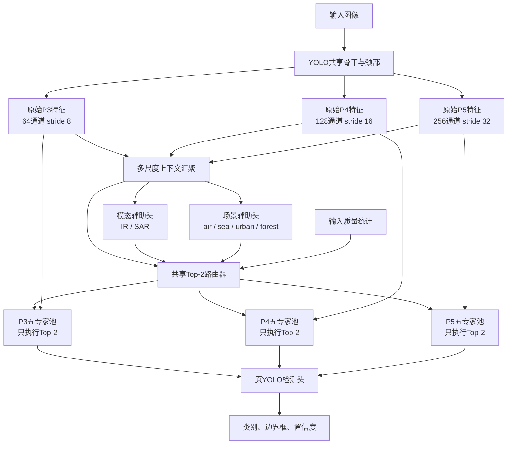

# 第三阶段稀疏多专家架构方案

> 日期：2026-08-30<br>
> 文档状态：待确认方案<br>
> 适用项目：ChallengeCup 智能识别与持续学习系统<br>
> 重要边界：本文只描述拟议架构，不代表已经完成实现；在方案获得明确确认前，不修改训练代码、不启动训练

---

## 1. 文档目的

本文依据 `docs/关键修正.md` 中的第三阶段要求，结合当前项目已经完成的 Agent、YOLO 检测、六阶段 Class-IL、ER 和 DER 实现，给出第一版稀疏多专家架构方案。

第三阶段在原文中的核心要求为：

```text
4～6个专家
Top-2路由
共享骨干
模态和场景辅助头
专家锚点巩固
```

本方案的目标是把这些能力接入当前正式六阶段 Class-IL 训练链，同时控制变量，避免一次叠加 P2、原型对齐、切片推理和 Copy-Paste 后无法判断实际收益来源。

---

## 2. 当前项目状态

### 2.1 已经完成的部分

当前项目已经具备：

- 六类别依次到达的单头 Class-IL 数据协议；
- `soldier → small_aircraft → warship → tank → patrol_boat → armored_vehicle` 六阶段训练；
- 200/500 固定容量、类别均衡回放池；
- ER 监督经验回放；
- DER 检测适配的在线教师暗响应回放；
- 阶段后独立 test 评估；
- 逐阶段、逐类别 mAP@0.5 和 mAP@0.5:0.95；
- AIA、平均遗忘和 BWT；
- Agent 单图/批量推理、场景—目标一致性和 JSON 报告；
- 稀疏路由、辅助头和专家锚点的早期脚手架。

### 2.2 当前检测器结构

本地基础权重实际为 Ultralytics `yolo26n.pt`，当前检测头使用三个尺度：

| 特征层 | Stride | 通道数 | 当前 Detect 输入 |
|---|---:|---:|---|
| P3 | 8 | 64 | 是 |
| P4 | 16 | 128 | 是 |
| P5 | 32 | 256 | 是 |

当前模型没有 P2 检测层。虽然 `docs/关键修正.md` 推荐最终研究 P2，但第三阶段首版不建议同时改检测尺度和专家结构。

### 2.3 现有专家代码的边界

现有组件还不能直接承担正式训练：

- `SparseExpertRouter` 是 NumPy 随机线性路由器，不能随 YOLO 反向传播；
- `ModalitySceneAuxiliaryHeads` 没有继承 `torch.nn.Module`；
- `ExpertAnchorBank` 使用 NumPy 展平参数，只能计算诊断值，不能产生可微损失；
- 这些组件没有进入 `IntelligentRecognitionAgent.run()`；
- 这些组件没有进入正式六阶段 ER/DER trainer；
- 当前配置文件描述的是研究目标，不会自动装配完整模型。

因此第三阶段需要实现 PyTorch 原生版本，而不是只把现有类名写入配置。

### 2.4 第二阶段尚未完全覆盖的内容

`docs/关键修正.md` 的第二阶段还提出：

- 旧类伪标签补全；
- P2/P3 目标区域特征蒸馏。

当前 DER 已实现上一阶段冻结教师、旧类分类响应和框响应匹配，但上述两项尚未完成。因此第三阶段可以在现有 ER/DER 基线上实现和评估，但不能宣称整个第二阶段已经完全落实。

---

## 3. Sparse-MoE v1 决策摘要

建议第三阶段首版采用：

| 配置项 | 建议方案 |
|---|---|
| 方案名 | Sparse-MoE v1 |
| 基础检测器 | 当前 `yolo26n` |
| 检测尺度 | P3/P4/P5 |
| 专家数量 | 5 |
| 激活数量 | Top-2 |
| 路由粒度 | 每张图片一次 |
| 路由共享方式 | 三个尺度共享一组专家 ID 和权重 |
| 专家位置 | Detect 输入之前 |
| 专家形式 | 轻量瓶颈残差适配器 |
| 辅助任务 | IR/SAR 模态分类 + 四类场景分类 |
| 持续巩固 | 专家参数锚点软约束 |
| 首个训练基线 | ER-500 |
| 第二个训练基线 | DER-500 |
| 首版不包含 | P2、原型、Copy-Paste、切片、Task-IL |

---

## 4. 总体架构



主要原则：

1. 原 YOLO 特征始终构成共享稳定路径；
2. 专家只学习特征残差，不替换主干；
3. 同一张图片在 P3/P4/P5 使用同一组 Top-2 专家；
4. 每个专家在三个尺度分别具有适配器参数；
5. 专家不预先绑定目标类别、模态或场景；
6. 专家实际角色通过训练后的激活统计分析；
7. 场景和模态信息只参与软路由，不硬覆盖检测结果。

---

## 5. 稀疏专家适配器

### 5.1 专家数量和命名

首版采用 5 个专家：

```text
expert_0
expert_1
expert_2
expert_3
expert_4
```

不在训练前命名为“IR 专家”“SAR 专家”或“士兵专家”，避免把人工假设误写成模型已经学习出的专家分工。

模型训练完成后，可以根据以下统计为专家生成解释性标签：

- IR/SAR 激活比例；
- air/sea/urban/forest 激活比例；
- 各目标类别的激活比例；
- 目标尺寸分布；
- 图像质量和困难样本占比；
- 各阶段激活稳定性。

### 5.2 单个专家结构

对第 `l` 个尺度的特征 `F`，专家使用：

\[
E_e^l(F)=
W_{up}
\left[
\operatorname{SiLU}
\left(
\operatorname{DWConv}_{3\times3}
\left(
W_{down}(F)
\right)
\right)
\right]
\]

其中：

- `W_down`：1×1 卷积，通道降到原来的 1/4；
- `DWConv`：3×3 深度卷积；
- `W_up`：1×1 卷积，恢复原通道数；
- 使用 SiLU 激活；
- `W_up` 零初始化，使专家刚插入时不改变基础模型输出。

### 5.3 特征融合

\[
\widetilde F^l
=
F^l
+
\sum_{e\in\operatorname{Top2}(g)}
\widehat g_e E_e^l(F^l)
\]

其中 `g` 是路由器输出，`g_hat` 是在选中的两个专家之间重新归一化后的权重。

原特征 `F` 本身就是始终存在的共享通路，因此不需要额外强制一个“共享专家”永久进入 Top-2。

### 5.4 计算开销预期

按照 64/128/256 通道和 1/4 bottleneck 粗略估算：

- 五个专家的三尺度适配器约增加 0.22M 参数；
- 加上路由器和辅助头后，预计总参数增量约为基础模型的 10%～12%；
- 单图只执行 2/5 专家，适配器实际计算量约为全专家执行的 40%；
- 正式结果必须实测参数、FLOPs、显存和延迟，不能只用理论值。

---

## 6. 共享 Top-2 路由器

### 6.1 为什么三个尺度共享路由

如果 P3、P4、P5 各自训练独立路由器，会带来三套路由分布和三倍坍缩风险。当前数据规模较小，首版采用图片级共享路由更稳妥：

- 参数更少；
- 同一图片的专家组合一致；
- 激活统计更容易解释；
- 专家锚点的重要性定义更清晰；
- Agent 报告只需输出一组专家 ID。

分尺度路由可以在共享路由跑通后作为独立消融。

### 6.2 路由查询

\[
q=
\operatorname{MLP}
\left[
\operatorname{Proj}(\operatorname{GAP}(P3)),
\operatorname{Proj}(\operatorname{GAP}(P4)),
\operatorname{Proj}(\operatorname{GAP}(P5)),
\operatorname{stopgrad}(p_m),
\operatorname{stopgrad}(p_s),
r
\right]
\]

其中：

- `p_m`：模型内部模态辅助头概率；
- `p_s`：模型内部场景辅助头概率；
- `r`：从当前输入直接计算的轻量质量统计；
- 辅助概率进入路由器前停止梯度，防止路由损失反向扭曲辅助头。

首版 `r` 只包含：

```text
图像均值
图像标准差
梯度能量
高频能量
```

首轮检测前还没有目标框和检测不确定性，所以首版不在 `r` 中加入目标尺寸或检测熵，避免循环依赖。

### 6.3 Top-2 选择

\[
p=\operatorname{softmax}(G(q)/T_r)
\]

对 `p` 取概率最高的两个专家，并重新归一化这两个权重。建议训练前几个 epoch 将路由温度由 2.0 逐步下降到 1.0，减少随机初始化阶段的路由坍缩。

推理阶段关闭随机噪声，保证同一模型和输入产生确定性路由。

---

## 7. 模态和场景辅助头

P3/P4/P5 分别进行 GAP 和线性投影，将投影特征拼接为 128 维上下文表示，再连接：

```text
modality_head：IR / SAR
scene_head：air / sea / urban / forest
```

首版不直接使用 Agent 外部的场景 SVM 或模态启发式控制路由，原因是：

- 训练和推理输入可能不一致；
- 外部模块错误会直接控制专家；
- checkpoint 无法独立运行；
- 不利于后续导出。

模型内部辅助头负责路由。Agent 原有结果继续保留，最终报告可以比较“Agent 外部判断”和“检测模型内部辅助判断”，但两者都不能硬覆盖检测 logits。

辅助损失：

\[
L_{aux}
=
\lambda_mL_{modality}
+
\lambda_sL_{scene}
\]

建议初始设置：

```text
lambda_modality = 0.10
lambda_scene    = 0.10
```

辅助权重保持较小，避免模型再次形成“场景直接决定目标类别”的背景捷径。

---

## 8. 训练元数据要求

当前正式数据的 `dataset_manifest.csv` 只有来源、增广和 split 信息，没有显式的 `sensor` 和 `scene` 字段。虽然现有文件名通常能解析模态和场景，但正式训练不应只依赖文件名猜测。

建议数据准备阶段为每个 Class-IL 阶段生成：

```text
context_index.csv
```

字段包括：

```text
materialized_image_path
source_image
sensor
scene
split
stage
sample_role
augmentation_operation
metadata_source
```

其中 `sample_role` 为：

```text
current
replay
val
test
```

处理原则：

1. 优先读取权威原始索引；
2. 文件名解析只能作为兼容回退；
3. 无法解析时标记 `unknown`；
4. 辅助损失通过 mask 跳过 unknown；
5. 严格正式训练可以拒绝元数据不完整的数据；
6. 元数据和数据集继续保持本地，不上传远端仓库。

---

## 9. 路由负载均衡

仅使用 Top-2 不能保证专家自动分工，最常见问题是所有图片长期选择相同两个专家。

建议使用 Switch-style 负载均衡损失：

\[
L_{balance}
=
E\sum_{e=1}^{E}\bar p_e\bar f_e
\]

其中：

- `E=5`；
- `p_bar` 是 batch 内专家平均软概率；
- `f_bar` 是专家进入 Top-2 的频率。

同时加入较小的 router z-loss，限制路由 logits 无限增大。

每个阶段必须记录：

- 专家进入 Top-2 的次数；
- 平均软路由概率；
- 路由熵；
- 最大专家占用率；
- 专家负载变异系数；
- 不同模态和场景下的专家分布；
- 不同目标类别和尺寸下的专家分布。

---

## 10. 专家锚点软巩固

首版不永久冻结专家，而是在每个增量阶段结束后保存专家参数锚点。

\[
\bar\theta_e^{(t)}
=
\rho\bar\theta_e^{(t-1)}
+
(1-\rho)\theta_e^{(t)}
\]

专家重要性由累计软路由概率或 Top-2 激活频率确定：

\[
\omega_e
=
\frac1t\sum_{k=1}^{t}\frac{n_e^{(k)}}{N_k}
\]

后续阶段加入：

\[
L_{anchor}
=
\sum_e
\omega_e
\frac{\|\theta_e-\bar\theta_e\|_2^2}{|\theta_e|}
\]

首版只约束专家适配器：

- 不约束共享 YOLO 骨干；
- 不约束检测头；
- 不约束路由器；
- 不永久冻结任何专家。

T1 没有历史锚点，因此 `L_anchor=0`。每阶段使用该阶段验证集选出的 `best.pt` 更新锚点，而不是使用最后一个 epoch。

---

## 11. 完整损失函数

### 11.1 ER + MoE

\[
L=
L_{YOLO}
+\lambda_mL_{modality}
+\lambda_sL_{scene}
+\lambda_{bal}L_{balance}
+\lambda_zL_{router-z}
+\lambda_aL_{anchor}
\]

### 11.2 DER + MoE

\[
L=
L_{YOLO}
+\lambda_{DER}L_{dark}
+\lambda_mL_{modality}
+\lambda_sL_{scene}
+\lambda_{bal}L_{balance}
+\lambda_zL_{router-z}
+\lambda_aL_{anchor}
\]

建议初始超参数：

| 参数 | 初始值 |
|---|---:|
| 专家数量 | 5 |
| Top-K | 2 |
| bottleneck ratio | 0.25 |
| router hidden dim | 128 |
| auxiliary hidden dim | 128 |
| auxiliary dropout | 0.10 |
| router temperature | 2.0 → 1.0 |
| `lambda_modality` | 0.10 |
| `lambda_scene` | 0.10 |
| `lambda_balance` | 0.01 |
| `lambda_router_z` | 0.001 |
| `lambda_anchor` | 0.001 |
| anchor `rho` | 0.95 |

`lambda_anchor` 后续至少比较：

```text
0
1e-4
1e-3
1e-2
```

---

## 12. 与六阶段 ER/DER 的组合

MoE 必须从 T1 开始参与六阶段训练，不能在 T6 训练完成后才插入，否则无法评估专家对持续学习的贡献。

```text
通用初始模型
→ 插入恒等初始化MoE
→ T1训练
→ 保存best模型、专家用量和锚点
→ T2恢复完整状态
→ ...
→ T6
```

DER 中：

- 教师为上一阶段完整 MoE checkpoint；
- 教师骨干、专家、路由器、辅助头全部冻结；
- 教师使用自己的内部辅助头和路由结果；
- 学生扩展新类别检测通道；
- 当前 DER 旧类分类/框响应损失保持不变；
- 专家锚点额外限制高重要性专家漂移。

当前 `DarkReplayModel` 通过 Ultralytics checkpoint loader 构造教师。加入自定义模型后，建议允许它接收已经由项目专用加载器构造好的教师模块，避免自定义 checkpoint 反序列化失败。

---

## 13. Checkpoint 和运行产物

每阶段至少保存：

```text
weights/best.pt
sparse_moe_config.json
expert_usage.json
expert_anchors.pt
context_metadata_summary.json
class_incremental_stage_summary.json
```

checkpoint 或配置必须记录：

- 基础模型架构；
- Detect 输入尺度和通道；
- 专家数量和 Top-K；
- bottleneck ratio；
- 模态和场景名称；
- 路由温度；
- 所有损失权重；
- 专家锚点和重要性；
- Python、PyTorch 和 Ultralytics 版本；
- 数据协议和随机种子。

需要提供项目专用加载器：

```text
load_sparse_moe_checkpoint()
```

不能假设其他机器上的普通 `YOLO(best.pt)` 一定能自动识别项目自定义模块。

---

## 14. Agent 推理输出

MoE 检测器应向 Agent 返回额外信息：

```json
{
  "expert_ids": [1, 4],
  "expert_weights": [0.62, 0.38],
  "router_entropy": 0.71,
  "aux_modality": {
    "label": "sar",
    "confidence": 0.93
  },
  "aux_scene": {
    "label": "sea",
    "confidence": 0.81
  }
}
```

接入原则：

- 保留 Agent 现有外部模态和场景判断；
- 单独记录模型内部辅助头结果；
- 输出二者是否一致；
- 不允许外部规则硬覆盖检测结果；
- 不把专家写成预设的 IR/SAR/类别专家；
- 检测框继承当前图片的专家 ID 和权重。

---

## 15. 建议的实现边界

方案确认后，建议按以下职责组织代码：

```text
Agent/models/experts/
├─ sparse_adapter.py
├─ torch_router.py
└─ usage_tracker.py

Agent/models/aux_heads/
└─ heads.py

Agent/continual/anchors/
└─ torch_expert_anchor.py

scene_recognition/detector_module/
├─ sparse_moe_model.py
├─ sparse_moe_trainer.py
├─ context_metadata.py
└─ sparse_moe_checkpoint.py
```

需要集成但保持兼容的文件：

```text
prepare_class_incremental_dataset.py
train_class_incremental_yolo.py
dark_experience_replay.py
Agent/detection.py
Agent/schemas.py
train.py
```

不建议直接修改本地虚拟环境中的 Ultralytics 源码。

---

## 16. 实施顺序

方案确认后，建议按以下顺序执行，每一步单独验证：

### 步骤 1：元数据闭环

- 生成 `context_index.csv`；
- 验证所有 train/val/test 和 current/replay 图像映射；
- 检查模态和场景覆盖；
- 保持来源组防泄漏。

### 步骤 2：PyTorch 专家基础组件

- 残差专家；
- 共享路由器；
- Top-2 真正稀疏执行；
- 使用统计；
- 辅助头；
- 可微锚点。

### 步骤 3：YOLO 接入

- 动态读取 Detect 输入层；
- 在 P3/P4/P5 与 Detect 之间注入专家；
- 保持原始 YOLO 输出格式；
- 验证零初始化前后输出一致。

### 步骤 4：ER 接入

- ER + MoE 联合损失；
- checkpoint 保存和恢复；
- T1/T2 冒烟；
- 六阶段 ER-500。

### 步骤 5：专家锚点

- 阶段结束更新；
- T2 以后恢复；
- 锚点权重和参数漂移统计。

### 步骤 6：DER 接入

- 自定义 MoE 教师加载；
- 冻结上一阶段完整模型；
- 验证暗响应形状和旧类通道；
- 六阶段 DER-500。

### 步骤 7：Agent 接入

- 加载 MoE checkpoint；
- 返回专家和辅助头信息；
- 更新 JSON schema；
- 正式推理继续关闭标签旁路。

---

## 17. 实验和消融

### 17.1 最小完整对比

| 实验 | 作用 |
|---|---|
| 当前 ER-500 | 精度基线，已有结果 |
| ER-500 + MoE + balance | 验证稀疏专家本身 |
| ER-500 + MoE + auxiliary + anchor | 验证完整第三阶段 |
| 当前 DER-500 | 稳定性基线，已有结果 |
| DER-500 + MoE + auxiliary + anchor | 验证 DER 与专家巩固组合 |

### 17.2 后续消融

资源允许时比较：

```text
专家数量：4 / 5 / 6
Top-K：1 / 2
锚点权重：0 / 1e-4 / 1e-3 / 1e-2
共享路由 / 分尺度路由
无辅助头 / 模态头 / 场景头 / 两者都有
```

### 17.3 检测与持续学习指标

- 各阶段 mAP@0.5；
- 各阶段 mAP@0.5:0.95；
- 每阶段每类别 Precision/Recall/AP；
- 最终平均性能；
- AIA；
- 平均遗忘；
- BWT；
- soldier 的 AP 和 Recall；
- 新增类别可塑性。

### 17.4 专家指标

- 专家激活频率；
- Top-2 专家对分布；
- 路由熵；
- 最大专家占用率；
- 负载变异系数；
- 模态/场景条件下的专家分布；
- 跨阶段路由稳定性；
- 专家参数漂移；
- 锚点惩罚值。

### 17.5 工程指标

- 参数量；
- 实际执行 FLOPs；
- 单图推理延迟；
- 训练显存；
- 推理显存；
- checkpoint 大小；
- 专家模块占总计算量比例。

---

## 18. 验收标准

### 18.1 功能正确性

- 六阶段完整训练成功；
- ER 和 DER 都可以启用/关闭 MoE；
- T1 不计算锚点；
- T2～T6 正确恢复锚点；
- 无未来类别标签泄漏；
- checkpoint 可重新加载且预测一致；
- Top-2 实际只执行两个专家；
- CPU 和 CUDA 至少完成冒烟测试；
- 正式推理不依赖真实标签旁路。

### 18.2 路由有效性

- 至少 4/5 专家在完整训练中获得有效激活；
- 单一专家长期占用率不超过约 70%；
- 不长期固定为完全相同的专家对；
- 不同模态或场景存在可分析的路由分布差异；
- 不要求专家必须符合人工预设角色。

### 18.3 性能目标

与同方法基线比较，至少满足一项：

- 最终 mAP@0.5 提升不少于 1 个百分点；
- 平均遗忘下降不少于 1 个百分点，同时最终 mAP@0.5 下降不超过 1.5；
- soldier 的 AP/Recall 明显改善，同时总体性能不显著下降。

### 18.4 工程开销目标

- 参数增量尽量不超过 15%；
- 平均推理延迟增量尽量不超过 20%；
- 显存和训练时间有完整记录；
- 不允许“执行全部专家后再屏蔽”的伪稀疏实现。

---

## 19. 主要风险和缓解措施

### 19.1 辅助头形成场景捷径

风险：场景辅助头强化“天空必有飞机、海洋必有船”的偏差。

缓解：

- 辅助损失保持小权重；
- 场景仅进入软路由；
- 不直接叠加检测 logits；
- 报告跨场景错误和目标遮挡诊断。

### 19.2 路由坍缩

风险：所有图片始终选择相同专家。

缓解：

- 路由温度退火；
- 负载均衡损失；
- router z-loss；
- 每阶段专家占用率预警；
- 单独评估专家数量和 Top-K。

### 19.3 专家增加参数但没有有效分工

缓解：必须同时提交路由统计、计算开销和消融结果，不能只报告最终 mAP。

### 19.4 DER 教师与学生路由漂移

缓解：首版用专家参数锚点约束；路由分布蒸馏作为后续独立消融，不在首版叠加。

### 19.5 元数据不可靠

缓解：生成显式上下文索引，文件名解析只作回退，严格训练拒绝缺失标签。

### 19.6 自定义 checkpoint 不可移植

缓解：提供项目加载器、保存配置和 state dict、增加保存—加载—预测一致性测试。

### 19.7 ONNX/昇腾部署风险

动态 Top-K 和按样本执行专家可能不能直接导出为目标运行时支持的静态图。第三阶段首版先完成 PyTorch 训练和评估；部署阶段需要单独验证，必要时把高频专家组合固化为静态子模型。

---

## 20. 待确认事项

开始实现前需要确认以下基线：

1. 是否接受首版继续使用当前 `yolo26n` 的 P3/P4/P5，而不同时加入 P2；
2. 是否接受 5 个专家、图片级共享 Top-2 路由；
3. 是否接受内部 IR/SAR 和四场景辅助头；
4. 是否接受专家锚点软约束，不永久冻结；
5. 是否先完成 ER-500 + MoE，再接 DER-500 + MoE；
6. 是否同意首版排除原型、Copy-Paste、切片和 Task-IL；
7. 是否接受新增显式 `context_index.csv`，数据仍只保留在本地；
8. 是否以本文第 18 节作为首轮验收标准。

建议确认版本：

```text
Sparse-MoE v1
当前yolo26n P3/P4/P5
5专家
Top-2
图片级共享路由
内部模态/场景辅助头
专家锚点软巩固
先ER-500，后DER-500
不同时改P2和原型系统
```

在上述方案获得明确确认前，本文件仅作为交流和评审依据，不代表第三阶段已经开始实施。
